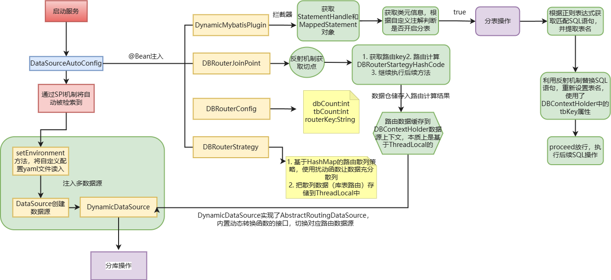

# DB-Router数据库路由组件

**系统架构**：基于 AOP、Spring 动态数据源切换、MyBatis 插件开发、散列算法等技术，实现的 SpringBoot Starter 数据库路由组件

**核心技术**：AOP、AbstractRoutingDataSource、MyBatis Plugin StatementHandler、扰动函数、哈希散列、ThreadLocal

**项目描述**：此组件项目是为了解决在分库分表场景下，开发一款可以应对自身业务场景多变特性，即支持个性的分库分表、只分库或者只分表以及双字段控制分库和分表，也可以自定义扩展监控、扫描、策略等规则，同时又能满足简单维护迭代的数据库路由组件。

**组件运行流程**：


**使用方式**：

- 克隆或下载这个仓库到你的本地计算机：`git@github.com:Weiguanghao918/db-router-spring-boot-starter.git`
- 用本地编译器打开项目后，使用Maven的方式执行安装命令 `mvn clean install`打包到本地Maven仓库。
- 在需要使用的分库分表的项目中引入该依赖：

```xml
<dependency>
    <groupId>cn.itedus.middleware</groupId>
    <artifactId>db-router-spring-boot-starter</artifactId>
    <version>1.0-SNAPSHOT</version>
</dependency>
```

- 在yml配置文件或者properties配置文件中按照以下格式配置数据库表：

```yml
# 多数据源路由配置
mini-db-router:
  jdbc:
    datasource:
      dbCount: 2
      tbCount: 4
      default: db00
      routerKey: uId
      list: db01,db02
      db00:
        driver-class-name: com.mysql.jdbc.Driver
        url: jdbc:mysql://192.168.10.101:3306/lottery?useUnicode=true&characterEncoding=utf8
        username: root
        password: 980918
      db01:
        driver-class-name: com.mysql.jdbc.Driver
        url: jdbc:mysql://192.168.10.101:3306/lottery_01?useUnicode=true&characterEncoding=utf8
        username: root
        password: 980918
      db02:
        driver-class-name: com.mysql.jdbc.Driver
        url: jdbc:mysql://192.168.10.101:3306/lottery_02?useUnicode=true&characterEncoding=utf8
        username: root
        password: 980918
```

- 在mapper文件中对于需要分库的mapper文件或者某个具体的方法加上注解`@DBRouter(传入分库字段，默认为uid)`
- 对于需要分表的mapper文件或者方法加上注解`@DBRouterStrategy(true)`


